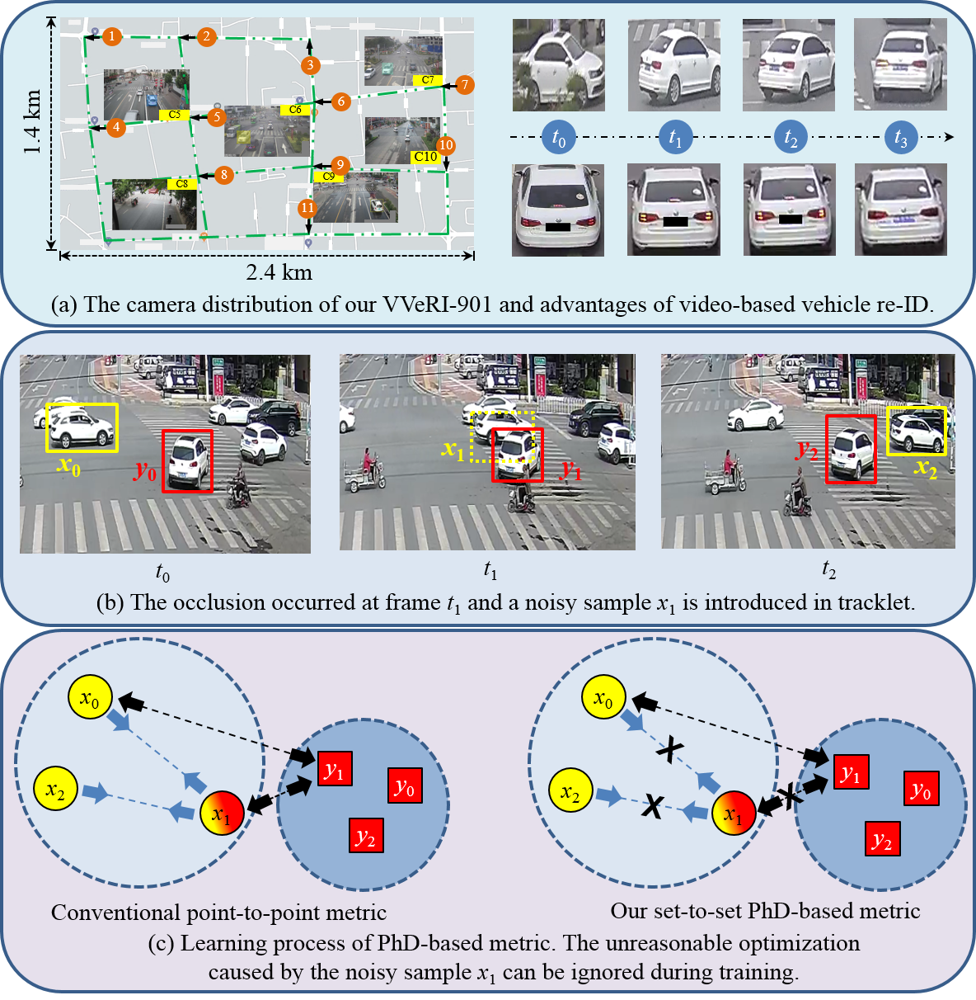
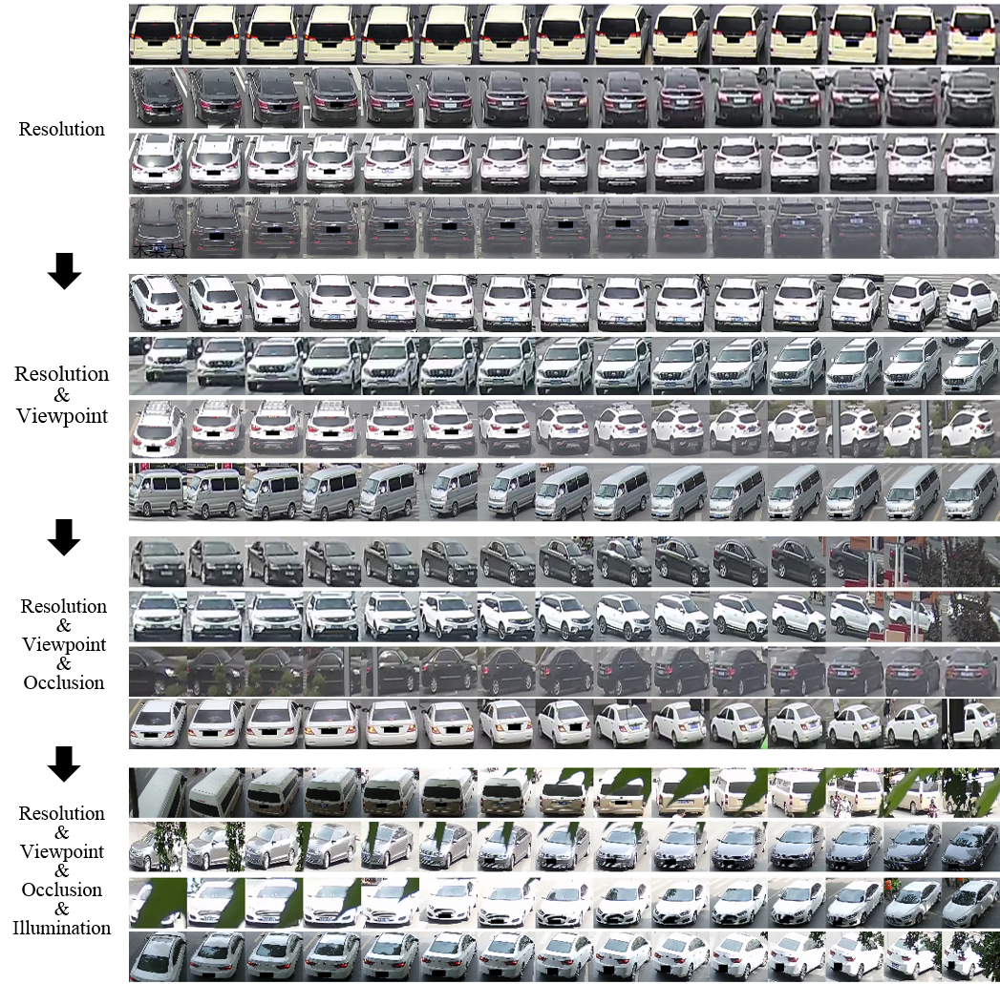
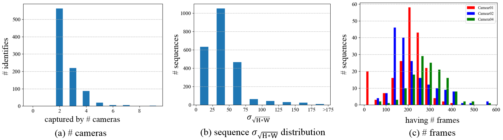
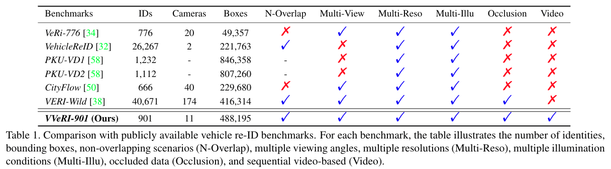
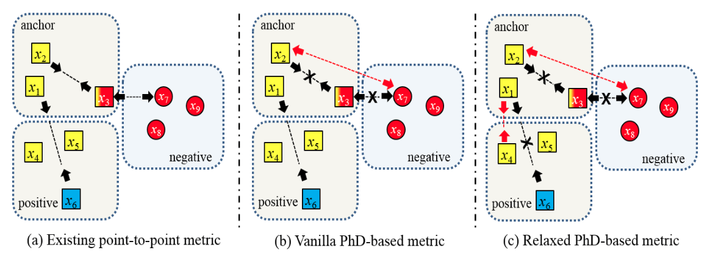
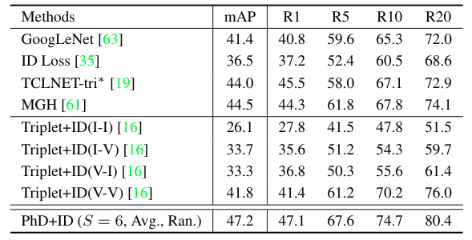
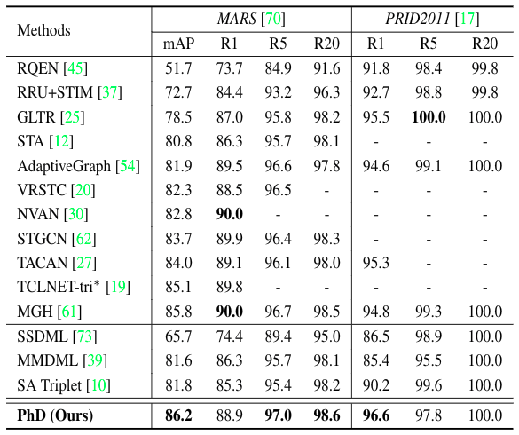

# PhD-Learning

This repository contains the pytorch implementation of **Phd loss** introduced in CVPR21 paper **PhD Learning: Learning with Pompeiu-hausdorff Distances for Video-basedVehicle Re-Identification.**

The whole project is established based on the open source project [**torchreid**]https://github.com/KaiyangZhou/deep-person-reid.

## Introduction
Static image-based approaches for vehicle re-ID task are intrinsically limited due to the visual ambiguities (e.g., occlusions, viewpoints,and resolutions) and the lack of spatio-temporal information.   Video  sequences  contain  richer  spatial  and  temporal clues and are beneficial for identifying a vehicle under complex surveillance conditions. Currently, making use of videos  brings  new  challenges  to  vehicle  re-ID.  The  difficulties  mainly  come  from  the  following  two  aspects: 1) An  adequate  quantity  and  high-quality  video-based  vehicle re-ID dataset is absent. 2) An effective video-based vehicle re-ID method of seeking discriminative features from the videos is also critically needed. To overcome the above limitations, 
- We firstly  createa  new  Video-based  Vehicle  Re-Identification  benchmark named [**VVeRI-901**](https://gas.graviti.cn/dataset/hello-dataset/VVeRI901).
- We then propose a set-to-set Pompeiu-hausdorff Distance (PhD) learning method for video-to-video matching. It can  eliminate  the  occlusion samples automatically during the optimization process.



## VVeRI-901

The  proposed  dataset  contains **901** IDs (i.e.,451 IDs for training and 450 IDs for testing), **2,320** tracklets, and **488,195** bounding boxes. 
Besides the vehicle re-ID task, more  related  research  areas  can  be  facilitated, like 
- cross-resolution re-ID, 
- cross-view matching,
- multi-view  synthesis.  

### Samples in VVeRI-901 dataset


### Statistic of the VVeRI-901 dataset


### Comparsion with other existing datasets


## PhD Loss

The pompeiu-hausdorff distance (PhD) is widely used to measure the similarity between two sets of points. In this work, we investigate the application of PhD metric learning in the field of person/vehicle video-based re-ID task and demonstrate the superiority of PhD metric learning in nosie resistance.



## Evaluation Results

### Vehicle video-based re-ID (VVeRI-901)


### Person video-based re-ID (Mars, PRID2011)


## Citation
Please cite the following reference if you feel our work is useful to your research.
```
@inproceedings{PhD_2021_CVPR,
  author = {Jianan Zhao and Fengliang Qi and Guangyu Ren and Lin Xu},
  title = {PhD Learning: Learning with Pompeiu-hausdorff Distances for Video-based Vehicle Re-Identification},
  booktitle = {The IEEE Conference on Computer Vision and Pattern Recognition (CVPR)},
  year  = {2021},
}
```

## Contact

For any question, please file an issue or contact

```
Jianan Zhao (Shanghai Em-Data Technology Co., Ltd.) jianan.zhao24@gmail.com
Fengliang Qi (Shanghai Em-Data Technology Co., Ltd.) fengliang.qi07@gmail.com
Guangyu Ren (Imperial College London) g.ren19@imperial.ac.uk
Lin Xu (Shanghai Em-Data Technology Co., Ltd.) lin.xu5470@gmail.com
```